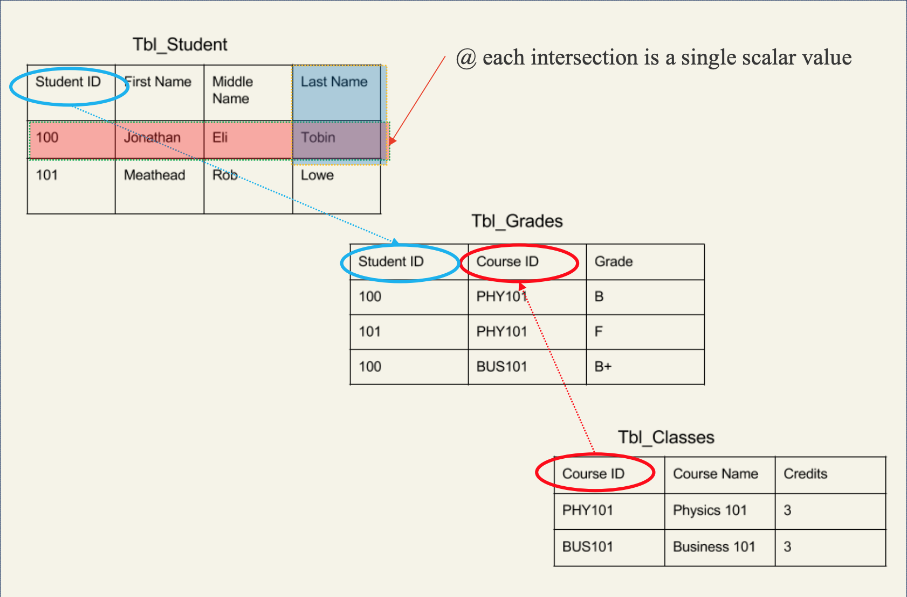

# MongoDB

__By__: Shabaz Badshah

__Date__: January 28, 2019

----

## What is MongoDB

MongoDB is a NoSQL Database, also commonly known as a Non-relational (hence NoSQL) database. MongoDB functions based on collections and documents and exposes a Javascript API that we can use to interact with the database.

MongoDB does not support schemas in contrast to its RDBMS alternatives. Data is instead stored in a format very similar to JSON (Javascript Object Notation) where fields can be added dynamically.

## MongoDB vs Relational Database Management Systems

| RDBMS    | MongoDB        |
|:---------|:---------------|
| Database | Database       |
| Table    | Collection     |
| Row      | Document       |
| Field    | Key:Value Pairs |

- MongoDB does not support foreign key constraints
- MongoDB does not support *Joins*, these are done at the application level
- There may be inconsistencies of data since data can be repeated between multiple collections
- MongoDB schemas are dynamic, fields can be added at any time
- Normalization/De-normalization is not required, set up the schema based on application requirements

### Example Data in PostgreSQL vs MongoDB

#### PostgreSQL Data Representation



#### MongoDB Data Representation

A Student collection which contains two documents of students and their course information

```json
{
  "_id": ObjectId("507f1f77bcf86cd799439011"),
  "studentId": 100,
  "firstName": "Jonathan",
  "middleName": "Eli",
  "lastName": "Tobin",
  "classes": [
    {
      "courseId": "PHY101",
      "grade": "B",
      "courseName": "Physics 101",
      "credits": 3
    },
    {
      "courseId": "BUS101",
      "grade": "B+",
      "courseName": "Business 101",
      "credits": 3
    }
  ]
},
{
  "_id":  ObjectId("507f191e810c19729de860ea"),
  "studentId": 101,
  "firstName": "Meathead",
  "middleName": "Rob",
  "lastName": "Lowe",
  "classes": [
    {
      "courseId": "PHY101",
      "grade": "F",
      "courseName": "Physics 101",
      "credits": 3
    }
  ]
},
```

## MongoDB Database Design and Modelling

### Embedding

### Linking/Referencing

## MongoDB Basic Queries

- __Select All:__ db.collection_name.find();
- __Select Top X:__ db.collection_name.find().limit(X);
- __Insert Single Document:__ db.collection_name.insert({field1: "value", field2: "value"});
- __Insert Multiple Documents:__ db.collection_name.insertMany([{field1: "value"}, {field2: "value"}]);
- __Update Document:__ db.collection_name.save({"_id": new ObjectId("abc"), field1: "value", field2: "value"});